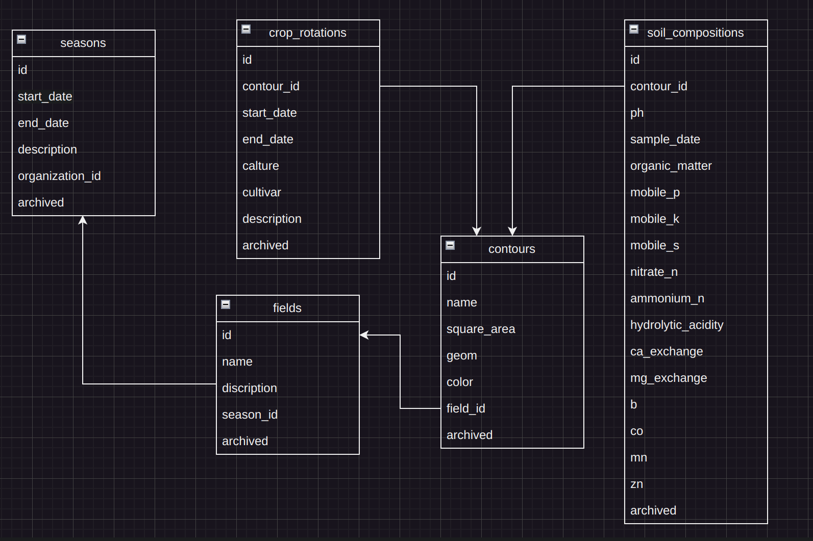

# Запуск проекта

docker compose up

# Конфигурация

Порт 8002, для бд порт 5434

Приложение обращается к метео сервису на порту 8003  
к контейнеру с названием "meteo-back" из той же сети  
agronetwork

сваггер http://localhost:8002/docs

# Схема БД

# Индексы

# Тесты

Тесты выполнялись с помощью библиотеки Junit 5  
./mvn clean test -- эта команда выполнит интеграционное тестирование  
Тестирование проводится с помощью тестового контейнера в докере.  
Контейнер поднимается и удаляется автоматически при запуске и окончании тестов.

## Покрытие тестов

# Разное

Даты в приложении принимаются в формате  
dd-MM-yyyy

# Запуск проекта для дебага и разработки

В директории local выполнить docker compose up , чтобы поднять локальную базу  
Указать профиль local при запуске. Сваггер http://localhost:8080/docs

